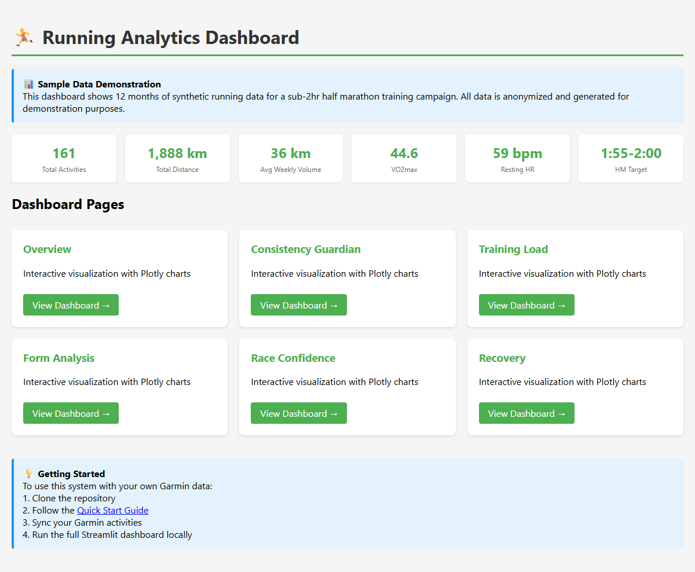

# Running Training Tracker

[](https://www.python.org/downloads/)
[](LICENSE)

**Local Garmin Connect sync + Streamlit dashboard for running analytics.** Track activities, monitor consistency, analyze training load, and plan races—all on your machine. No cloud uploads.



---

## Try the Demo

**No Garmin account?** Explore interactive dashboards with sample data:

- **[View HTML Dashboards](media/dashboard-snapshots/index.html)** — Open in browser, no install
- Or run the full dashboard: `USE_SAMPLE_DATA=true streamlit run dashboard/app.py`

---

## Features

### Core Functionality
- 🏃 **Sync activities** from Garmin Connect (incremental merge)
- 📊 **Interactive dashboard** with 10 analysis pages
- 💓 **Heart rate data** with per-km splits and zone analysis
- 📈 **Training load** tracking and volume monitoring
- 🎯 **Season planning** with race readiness metrics
- 🔒 **Local storage** — all data stays on your machine

### Advanced Features
- 🏋️ **Create Garmin workouts** — Build structured workouts and schedule to watch
- ⚡ **Weekly summaries** — Automated training reports
- 🎪 **Consistency tracking** — Volume floor monitoring (green/yellow/red)
- 🔍 **Data validation** — Integrity checks and backups
- 📝 **FIT file parsing** — Deep-dive per-second analysis

---

## Quick Start

### 1. Install

```bash
git clone <repo-url>
cd running

# Core sync (required)
pip install -r scripts/requirements.txt

# Dashboard (optional)
pip install -r requirements-dashboard.txt
```

### 2. Setup Garmin Authentication

```bash
python scripts/import-session.py
```

Follow prompts to import Garmin Connect cookies from your browser.

### 3. Sync Activities

```bash
# First time: sync last 90 days
python scripts/incremental-sync.py --days 90

# Daily: sync last 7 days
python scripts/daily-sync.py
```

### 4. View Dashboard

```bash
streamlit run dashboard/app.py
```

Opens at `http://localhost:8501` (use `--server.port 8502` if 8501 is in use).

---

## Dashboard Pages

| Page | Description |
|------|-------------|
| **📊 Consistency Guardian** | Weekly volume with color-coded status, streaks, rolling averages |
| **🎯 Season Compare** | Side-by-side season comparison, VO2max progression |
| **🏁 Race Confidence** | Pace sustainability, race calculator, fatigue resistance |
| **📋 Season Plan** | Training plan calendar, workout scheduling |
| **📝 Weekly Logs** | Detailed weekly summaries, notes, ratings |
| **🚨 Risk Monitor** | Load spikes, consistency violations, recovery alerts |
| **📈 Training Load** | ACWR, sleep quality, HR zone distribution |
| **💤 Recovery** | Sleep stages, resting HR trends, recovery score |
| **👟 Form** | Cadence trends, ground contact time, stride analysis |
| **✅ Compliance** | Plan adherence, completed vs planned workouts |

---

## Demo Mode (Try Without Syncing)

Explore the dashboard with sample data—no Garmin account required.

### Option A: Interactive HTML Dashboards

Browse pre-generated dashboards in [media/dashboard-snapshots/](media/dashboard-snapshots/):

- **[index.html](media/dashboard-snapshots/index.html)** — Hub with links to all pages
- **overview.html** — 12-week volume trends
- **consistency.html** — Weekly status analysis
- **training-load.html** — Sleep & HR zones
- **form.html** — Cadence trends
- **race-confidence.html** — Pace degradation
- **recovery.html** — Sleep stages

*Download and open in a browser for full interactivity.*

### Option B: Full Streamlit Dashboard

```bash
# Linux/Mac
export USE_SAMPLE_DATA=true
streamlit run dashboard/app.py

# Windows PowerShell
$env:USE_SAMPLE_DATA='true'
streamlit run dashboard/app.py
```

Sample dataset: 161 activities over 12 months. See [sample-data/README.md](sample-data/README.md).

---

## Documentation

| Guide | Description |
|-------|-------------|
| [Quick Start](QUICK-START.md) | 5-minute setup for syncing |
| [Scripts Reference](scripts/README.md) | All scripts documented |
| [Workflow Guide](WORKFLOW.md) | Daily/weekly check-ins, gait analysis |
| [Garmin Workouts](GARMIN-WORKOUT-AUTOMATION.md) | Build and schedule structured workouts |
| [Architecture](docs/ARCHITECTURE.md) | System design and data flow |
| [Dashboard Guide](dashboard/README.md) | Using the Streamlit dashboard |

---

## Common Commands

| Task | Command |
|------|---------|
| Initial sync (90 days) | `python scripts/incremental-sync.py --days 90` |
| Daily sync | `python scripts/daily-sync.py` |
| View dashboard | `streamlit run dashboard/app.py` |
| Create workout | `python scripts/create-garmin-workouts.py --week 3` |
| Weekly summary | `python scripts/weekly-summary.py` |
| Verify data | `python scripts/verify-data-integrity.py` |
| Parse FIT file | `python scripts/parse-fit.py path/to/file.fit` |

---

## Project Structure

```
running/
├── scripts/                      # Automation scripts
│   ├── incremental-sync.py      # Primary sync (use this)
│   ├── daily-sync.py            # Convenience wrapper
│   ├── create-garmin-workouts.py # Build workouts
│   ├── weekly-summary.py        # Training reports
│   ├── verify-data-integrity.py # Data validation
│   ├── consistency-guardian.py  # Volume tracking
│   ├── parse-fit.py             # FIT file parser
│   ├── import-session.py        # Auth setup
│   └── export-dashboards-html.py # HTML dashboard exporter
│
├── dashboard/                    # Streamlit visualization
│   ├── app.py                   # Main dashboard
│   └── pages/                   # 10 analysis pages
│
├── tracking/                    # Local data cache (gitignored)
│   ├── unified-cache.json       # Single source of truth
│   ├── backups/                 # Auto backups
│   └── fit_files/               # Raw FIT files
│
├── sample-data/                 # Demo dataset
├── media/dashboard-snapshots/   # HTML dashboards (public)
└── docs/                        # Documentation
```

---

## Requirements

- **Python 3.8+**
- **Garmin Connect account**
- **Chrome or Firefox** (for cookie import)

---

## How It Works

1. **Authentication** — Import Garmin Connect session cookies (valid ~2 weeks)
2. **Sync** — Fetch activities from Garmin Connect API
3. **Storage** — Save to `tracking/unified-cache.json` (single source of truth)
4. **Dashboard** — Visualize with Streamlit (optional)

```
Garmin Connect API
        ↓
incremental-sync.py (merge new activities)
        ↓
tracking/unified-cache.json
        ↓
Dashboard (visualization)
```

---

## Roadmap

- [x] Garmin activity sync with incremental merge
- [x] Interactive dashboard with 10 pages
- [x] Garmin workout creation and scheduling
- [x] Sample data for demonstrations
- [x] Data validation and integrity checks
- [ ] Strava integration (phased out, see `scripts/archived/strava/`)
- [ ] Simplified setup wizard
- [ ] Mobile-friendly dashboard
- [ ] Export to Excel/CSV

---

## Contributing

See [CONTRIBUTING.md](CONTRIBUTING.md) for guidelines.

---

## License

MIT License — Free to use and modify. See [LICENSE](LICENSE).
